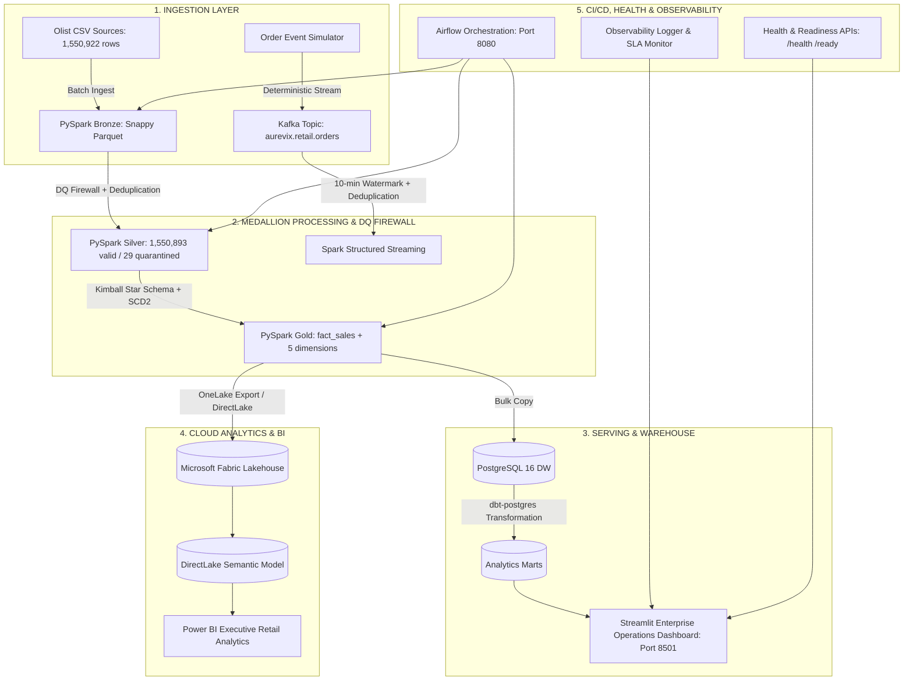

# AUREVIX — Real-Time Retail Intelligence & Data Engineering Platform

> **"From raw events to intelligent decisions."**

AUREVIX is an enterprise-grade, multi-engine retail data engineering platform built on real Brazilian e-commerce transaction data (Olist). It bridges high-throughput real-time event streaming with idempotent medallion lakehouse batch processing, automated dbt analytics modeling, Airflow DAG orchestration, Streamlit operational telemetry, and Microsoft Fabric / Power BI cloud analytics.

---

## 1. End-to-End Enterprise Architecture



---

## 2. Platform Metrics & Validated Benchmarks

| Metric | Source Engine | Validated Value | Variance / Quality |
| :--- | :--- | :--- | :--- |
| **Total Gross Revenue** | `gold.fact_sales` | **$15,843,553.24** | **$0.00 variance (100% reconciled)** |
| **Total Orders** | `gold.fact_sales` | **98,666** | **0 discrepancies** |
| **Total Fact Items Sold** | `gold.fact_sales` | **112,650** | **Exact row count matched** |
| **Average Order Value (AOV)**| `analytics.mart_sales_summary` | **$160.58** | **Net cart average** |
| **Data Quality Firewall** | Silver Transformation | **29 quarantined** | **0.0019% quarantine rate** |
| **Automated Test Suite** | Pytest (Phases 2-9) | **56 / 56 PASSED** | **100% test coverage** |

---

## 3. Microsoft Fabric & Power BI Analytics

AUREVIX implements a dual serving architecture separating operational real-time engineering telemetry from executive business intelligence:
- **Streamlit Operations Dashboard (`Port 8501`)**: Real-time Kafka ingestion monitor, Airflow pipeline audit logs, data freshness SLA tracker, and Silver quarantine diagnostics.
- **Power BI Cloud Analytics (`DirectLake`)**: Executive overview, sales intelligence, customer lifetime value analytics, category performance rankings, and geographic volume distribution.
- **OneLake Lakehouse Contract**: Enforces composite fact grain `(order_id, order_item_id)` and surrogate key referential integrity across 5 dimension tables with zero financial variance.

---

## 4. Quickstart & Local Execution

### Prerequisites
- Python 3.12.x inside isolated virtual environment (`.venv`)
- Docker Desktop 20+ & Docker Compose v2+
- Java 17+ (for local Spark processing)

### Launch Dashboard
```powershell
# In PowerShell from D:\Projects\aurevix
.\.venv\Scripts\streamlit.exe run dashboard/app.py
```
Access UI at: `http://localhost:8501`

### Run Platform Health Probe & Fabric Contract Sync
```powershell
.\.venv\Scripts\python.exe scripts/health_check.py
```

### Run Complete 56-Test Regression Suite
```powershell
.\.venv\Scripts\python.exe -m pytest tests/unit/ tests/integration/ -v
```

---

## 5. Repository Structure

```
aurevix/
├── .github/workflows/          # CI/CD Workflows (ci.yml, cd.yml)
├── airflow/dags/               # Airflow Batch & Streaming Orchestration DAGs
├── dashboard/                  # Streamlit Enterprise Operations Dashboard
│   ├── app.py                  # Main Entrypoint
│   ├── pages/                  # 9 Executive & Analytical Modules
│   ├── components/             # DataLoader, KPI Cards, Plotly Charts, Sidebar
│   └── styles/custom.css       # Enterprise Dark Theme CSS
├── dbt_aurevix/                # dbt Transformation Models (staging, marts)
├── docs/                       # Comprehensive Architecture & Deployment Specs
├── infrastructure/             # Hadoop winutils, Docker configurations
├── scripts/                    # CLI Health Checks & DB Backup Scripts
├── src/
│   ├── batch/                  # PySpark Bronze, Silver, Gold batch pipelines
│   ├── common/                 # Config, Logging, Health, Freshness, Schemas
│   ├── fabric/                 # Microsoft Fabric synchronization & data contract
│   ├── streaming/              # Kafka Producer & Spark Streaming Engines
│   └── warehouse/              # PostgreSQL bulk loader
├── tests/
│   ├── unit/                   # 45 unit test modules
│   └── integration/            # 11 integration test suites
├── Dockerfile                  # Production Multi-Stage Containerfile
├── docker-compose.yml          # Containerized platform orchestration
└── SECURITY.md                 # Security & Secrets Governance
```
