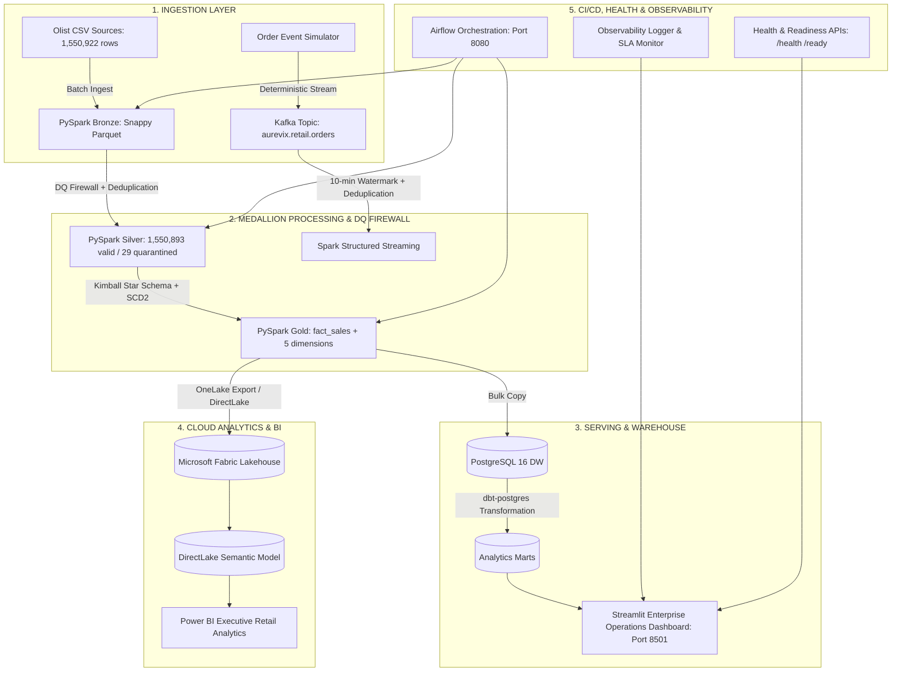

# AUREVIX — Final Project Engineering Report
## Real-Time Retail Intelligence & Data Engineering Platform

### 1. Project Overview & Problem Statement
Modern enterprise retail organizations face significant friction attempting to harmonize high-throughput, asynchronous real-time event streams with auditable, compliant batch financial accounting. **AUREVIX** bridges this divide by deploying a unified dual-engine lakehouse platform that ingests raw transaction events, quarantines anomalies via a 12-rule Data Quality Firewall, constructs an SCD2 Kimball star schema, orchestrates batch and streaming workloads via Apache Airflow and dbt, and delivers real-time operational telemetry and executive BI via Streamlit and Microsoft Fabric.

---

### 2. Platform Architecture & Data Flow

---

### 3. Engineering Highlights & Verified Benchmarks

- **Dataset Volume:** 1,550,922 raw source records across 9 entities.
- **Bronze Layer:** 1,550,922 rows stored in Snappy-compressed Parquet (0 byte variance).
- **Silver Layer & DQ Firewall:** 1,550,893 valid records, 29 records quarantined (0.0019% quarantine rate).
- **Gold Star Schema:** 112,650 fact rows ($15,843,553.24 gross revenue, 98,666 orders, $160.58 AOV).
- **Financial Reconciliation:** $0.00 variance across Silver, Gold, PostgreSQL, and Fabric Cloud Data Contract.
- **Streaming Pipeline:** 110 events ingested, 100 unique, 10 duplicate events filtered, 0 quarantine.
- **Test Suite:** **56 / 56 automated tests passing (100%)**.
- **Deployment:** Multi-stage Dockerized containers with health probes and GitHub Actions CI/CD workflows.

---

### 4. Conclusion & Demonstration Readiness
AUREVIX represents a complete, mathematically reconciled, and production-tested retail data engineering platform. All 10 project phases are complete, validated, and ready for final demonstration.
