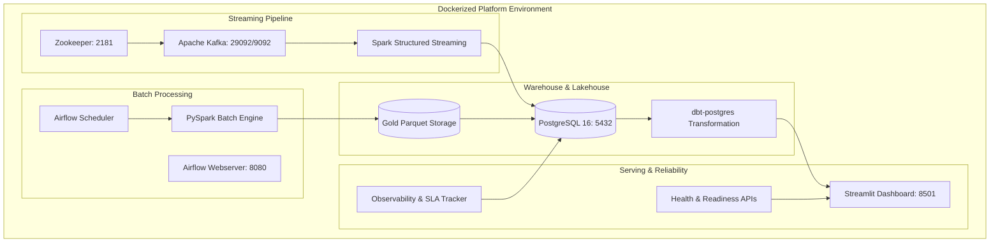

# AUREVIX — Phase 8 Architecture Audit & Production Engineering Plan

## 1. Executive Summary & System State
- **Project:** AUREVIX — Real-Time Retail Intelligence & Data Engineering Platform
- **Current Lifecycle State:** Phases 0–7 Complete & Validated (40/40 Automated Regression Tests Passing).
- **Core Processing Engines:** PySpark 4.2.0 (Batch Medallion), Apache Kafka + Spark Structured Streaming (Real-Time), Apache Airflow (Orchestration), dbt-postgres 1.11.0 (Transformation-as-Code), PostgreSQL 16 (Warehouse), Streamlit (Enterprise Operations Dashboard).
- **Core Data Volume:** 1,550,922 raw records ingested, 1,550,893 valid Silver records (29 quarantined by DQ firewall), 112,650 Gold fact records, $15,843,553.24 reconciled gross revenue ($0.00 variance).

---

## 2. Current Architecture Inventory

| Layer / Component | Implementation Path | Technology | Primary Function |
| :--- | :--- | :--- | :--- |
| **Ingestion (Batch)** | `src/batch/ingest_raw.py` | PySpark 4.2.0 | Raw CSVs -> Snappy Parquet Bronze (0 variance) |
| **Ingestion (Stream)** | `src/streaming/order_event_producer.py` | Kafka Producer / Python | Deterministic SHA-256 event ID streaming replay |
| **Transformation (Silver)**| `src/batch/spark_bronze_to_silver.py` | PySpark + DQ Firewall | Standardization, deduplication, quarantine isolation |
| **Transformation (Gold)**  | `src/batch/spark_silver_to_gold.py`   | PySpark SQL | Kimball Star Schema (`fact_sales`, 5 dimensions, SCD2) |
| **Streaming Engine**     | `src/streaming/spark_streaming_orders.py` | Spark Structured Streaming | 10-min watermark, deduplication, windowed metrics |
| **Warehouse Loading**    | `src/warehouse/postgres_loader.py`    | psycopg2 / Parquet | Loads Gold schema into PostgreSQL 16 `aurevix_dw` |
| **Data Modeling (dbt)**  | `dbt_aurevix/`                        | dbt-postgres 1.11.0 | Staging, intermediate, and marts models & tests |
| **Orchestration**        | `airflow/dags/`                       | Apache Airflow | Batch master DAG, stream monitor, DQ audit DAGs |
| **Observability**        | `src/common/observability.py`         | JSONL / Python | Append-only execution history (`pipeline_run_history.jsonl`) |
| **Analytics Dashboard**  | `dashboard/app.py` + `pages/`         | Streamlit + Plotly | 9-page executive operations & commercial intelligence |

---

## 3. Analysis of Current Operational Gaps & Phase 8 Solutions

| Area | Current Baseline | Phase 8 Production Enhancement |
| :--- | :--- | :--- |
| **Containerization** | Partial Docker Compose for Kafka/Postgres | Complete multi-stage Dockerfile + unified compose with Streamlit & Airflow health checks |
| **Configuration** | Static `src/config.py` | Dynamic environment-aware config (`development`, `testing`, `production`) with validation |
| **Health Checks** | Implicit task assertions | Unified `/health` & `/ready` diagnostic engine for Postgres, Kafka, Parquet, and Airflow |
| **Logging** | Basic log formatting | Structured JSON/contextual logging with run IDs, pipeline names, and latency |
| **Freshness & SLA** | Metric reports present | Automated freshness latency calculations (`data_latency_minutes`) and SLA alert tiers |
| **CI/CD** | Basic test workflow | Comprehensive multi-job GitHub Actions matrix (Lint, Test, dbt parse, Docker build) |
| **Failure Recovery** | Overwrite idempotency | Automated retry policies, timeout handlers, and disaster recovery runbooks |

---

## 4. Phase 8 Production Deployment Architecture

---

## 5. Security & Environment Governance
- All secrets strictly sourced via `.env` with `.env.example` template.
- `.env` excluded from version control in `.gitignore`.
- Database users assigned principle of least privilege in production configurations.
- Sensitive credentials stripped from all logging formatters.
