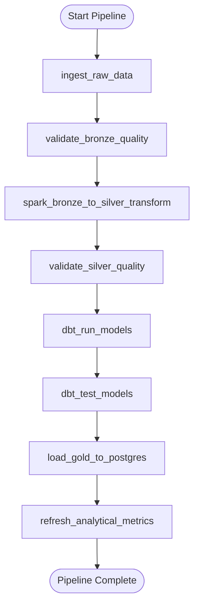

# AUREVIX - Airflow Orchestration Specification

## DAG: `aurevix_batch_pipeline`
- **Schedule:** `@daily`
- **Catchup:** `False`
- **Retries:** 2 retries with 5-minute exponential backoff
- **SLA & Alerting:** Built-in task execution tracking and failure callbacks
