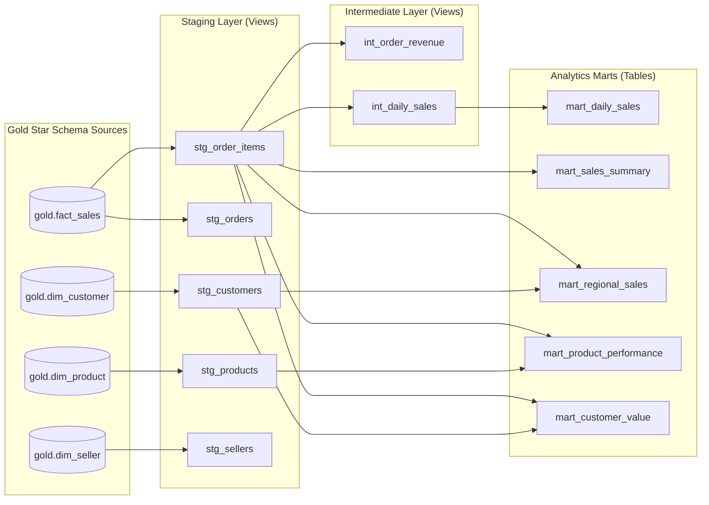

# AUREVIX — dbt-postgres Transformation Architecture

## 1. Lineage Architecture (Mermaid)

```mermaid
flowchart LR
    subgraph Gold ["Gold Star Schema Sources"]
        FS[(gold.fact_sales)]
        DC[(gold.dim_customer)]
        DP[(gold.dim_product)]
        DS[(gold.dim_seller)]
    end

    subgraph Staging ["Staging Layer (Views)"]
        stg_oi[stg_order_items]
        stg_o[stg_orders]
        stg_c[stg_customers]
        stg_p[stg_products]
        stg_s[stg_sellers]
    end

    subgraph Intermediate ["Intermediate Layer (Views)"]
        int_rev[int_order_revenue]
        int_ds[int_daily_sales]
    end

    subgraph Marts ["Analytics Marts (Tables)"]
        mart_ds[mart_daily_sales]
        mart_sum[mart_sales_summary]
        mart_reg[mart_regional_sales]
        mart_prod[mart_product_performance]
        mart_clv[mart_customer_value]
    end

    FS --> stg_oi
    FS --> stg_o
    DC --> stg_c
    DP --> stg_p
    DS --> stg_s

    stg_oi --> int_rev
    stg_oi --> int_ds
    int_ds --> mart_ds
    stg_oi --> mart_sum
    stg_oi & stg_c --> mart_reg
    stg_oi & stg_p --> mart_prod
    stg_oi & stg_c --> mart_clv
```
