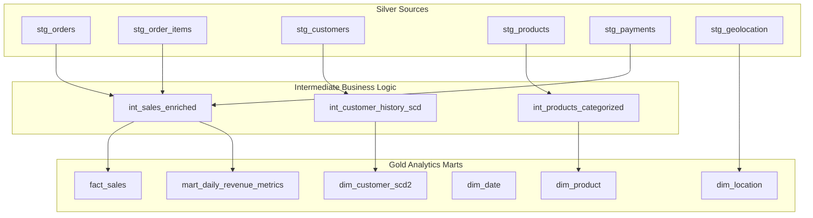

# AUREVIX - dbt Lineage & Modeling Architecture

```mermaid
flowchart TD
    subgraph SOURCES [Silver Sources]
        SRC_ORD[stg_orders]
        SRC_ITEMS[stg_order_items]
        SRC_CUST[stg_customers]
        SRC_PROD[stg_products]
        SRC_PAY[stg_payments]
        SRC_GEO[stg_geolocation]
    end

    subgraph INTERMEDIATE [Intermediate Business Logic]
        INT_SALES[int_sales_enriched]
        INT_CUST_HIST[int_customer_history_scd]
        INT_PROD_CAT[int_products_categorized]
    end

    subgraph MARTS [Gold Analytics Marts]
        FACT_SALES[fact_sales]
        DIM_CUST[dim_customer_scd2]
        DIM_PROD[dim_product]
        DIM_DATE[dim_date]
        DIM_LOC[dim_location]
        MART_DAILY_SALES[mart_daily_revenue_metrics]
    end

    SRC_ORD --> INT_SALES
    SRC_ITEMS --> INT_SALES
    SRC_PAY --> INT_SALES
    SRC_CUST --> INT_CUST_HIST
    SRC_PROD --> INT_PROD_CAT
    SRC_GEO --> DIM_LOC

    INT_SALES --> FACT_SALES
    INT_SALES --> MART_DAILY_SALES
    INT_CUST_HIST --> DIM_CUST
    INT_PROD_CAT --> DIM_PROD
```
