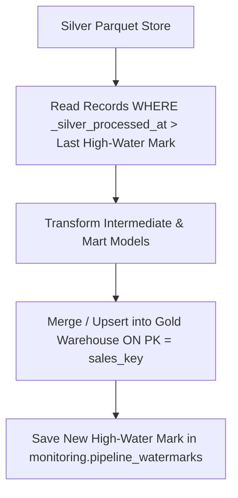

# AUREVIX — Incremental Processing & Idempotency Design

## 1. Incremental Batch Processing Design
To avoid recomputing millions of historical records on every Airflow run, AUREVIX utilizes a high-water mark incremental loading architecture.



### High-Water Mark Tracking
- **Tracking Table:** `monitoring.pipeline_watermarks`
- **Columns:** `pipeline_name`, `source_table`, `high_water_mark_timestamp`, `last_run_id`, `updated_at`.
- **Incremental Column:** `_silver_processed_at` (for Silver -> Gold) or `order_purchase_timestamp`.

---

## 2. Idempotency Guarantees
AUREVIX guarantees that running the batch pipeline multiple times over the same input data produces identical warehouse state without duplicating business records.

### Implementation Mechanisms:
1. **Deterministic Primary Keys:** `sales_key` is calculated deterministically:
   $$	ext{sales\_key} = 	ext{BIGINT}(	ext{MD5}(	ext{order\_id} \parallel 	ext{"-"} \parallel 	ext{order\_item\_id}))$$
2. **PostgreSQL MERGE / UPSERT:**
   ```sql
   INSERT INTO gold.fact_sales (sales_key, order_id, order_item_id, ...)
   VALUES (%s, %s, %s, ...)
   ON CONFLICT (sales_key) DO UPDATE SET
       price = EXCLUDED.price,
       freight_value = EXCLUDED.freight_value,
       total_amount = EXCLUDED.total_amount,
       order_status = EXCLUDED.order_status,
       _gold_loaded_at = EXCLUDED._gold_loaded_at;
   ```
3. **dbt Incremental Strategy:** dbt models use `is_incremental()` macros with `unique_key = 'sales_key'`.

---

## 3. Late-Arriving Data & Backfill Handling
- **Late-Arriving Events:** If a record arrives with an earlier purchase timestamp, the high-water mark logic captures it via `_silver_processed_at > last_watermark`.
- **Backfill CLI:** `scripts/ingest_raw.py --backfill --start-date YYYY-MM-DD --end-date YYYY-MM-DD` allows deterministic historical partition reprocessing.
