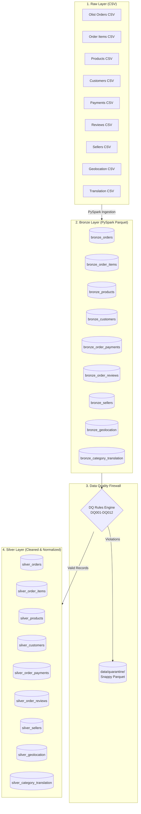

# AUREVIX — Medallion Architecture Specification

```mermaid
flowchart TD
    subgraph Raw ["1. Raw Layer (CSV)"]
        R1[Olist Orders CSV]
        R2[Order Items CSV]
        R3[Products CSV]
        R4[Customers CSV]
        R5[Payments CSV]
        R6[Reviews CSV]
        R7[Sellers CSV]
        R8[Geolocation CSV]
        R9[Translation CSV]
    end

    subgraph Bronze ["2. Bronze Layer (PySpark Parquet)"]
        B1[(bronze_orders)]
        B2[(bronze_order_items)]
        B3[(bronze_products)]
        B4[(bronze_customers)]
        B5[(bronze_order_payments)]
        B6[(bronze_order_reviews)]
        B7[(bronze_sellers)]
        B8[(bronze_geolocation)]
        B9[(bronze_category_translation)]
    end

    subgraph DQ ["3. Data Quality Firewall"]
        FW{DQ Rules Engine\nDQ001-DQ012}
        Q[(data/quarantine/\nSnappy Parquet)]
    end

    subgraph Silver ["4. Silver Layer (Cleaned & Normalized)"]
        S1[(silver_orders)]
        S2[(silver_order_items)]
        S3[(silver_products)]
        S4[(silver_customers)]
        S5[(silver_order_payments)]
        S6[(silver_order_reviews)]
        S7[(silver_sellers)]
        S8[(silver_geolocation)]
        S9[(silver_category_translation)]
    end

    Raw -->|PySpark Ingestion| Bronze
    Bronze --> FW
    FW -->|Violations| Q
    FW -->|Valid Records| Silver
```
