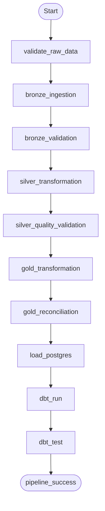

# AUREVIX — Master Orchestration Architecture (Apache Airflow)

## 1. Batch Master DAG Pipeline (`aurevix_batch_pipeline`)

## 2. DAG Topology & Responsibilities
- **`aurevix_batch_pipeline`**: End-to-end daily batch orchestrator running raw validation, PySpark Medallion transforms, PostgreSQL warehouse loading, and dbt analytics mart compilation.
- **`aurevix_streaming_monitor`**: Monitors Kafka topic latency, consumer freshness, and streaming metrics report.
- **`aurevix_data_quality`**: Evaluates cross-layer data quality thresholds and generates `data/monitoring/airflow_quality_report.json`.
