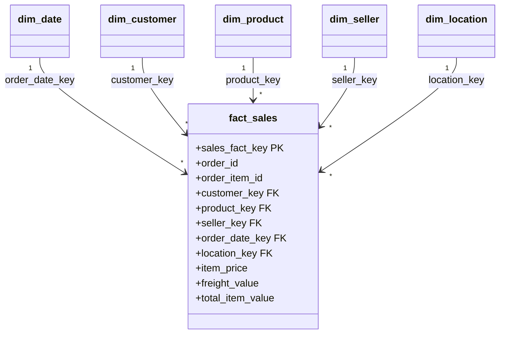

# AUREVIX — Power BI Semantic Model & DAX Measures Catalog

## 1. Semantic Model Star Schema Topology



---

## 2. Explicit DAX Production Measures

### Core Financial & Commercial Measures
```dax
Total Gross Revenue = SUM(fact_sales[total_item_value])

Total Product Revenue = SUM(fact_sales[item_price])

Total Freight Revenue = SUM(fact_sales[freight_value])

Total Orders = DISTINCTCOUNT(fact_sales[order_id])

Total Units Sold = COUNTROWS(fact_sales)

Average Order Value = DIVIDE([Total Gross Revenue], [Total Orders], 0)

Average Freight per Item = DIVIDE([Total Freight Revenue], [Total Units Sold], 0)
```

### Growth & Variance Measures
```dax
Revenue Prior Month = CALCULATE([Total Gross Revenue], DATEADD(dim_date[full_date], -1, MONTH))

Revenue Growth % = DIVIDE([Total Gross Revenue] - [Revenue Prior Month], [Revenue Prior Month], 0)

Order Growth % = DIVIDE([Total Orders] - CALCULATE([Total Orders], DATEADD(dim_date[full_date], -1, MONTH)), CALCULATE([Total Orders], DATEADD(dim_date[full_date], -1, MONTH)), 0)
```

### Customer & Lifetime Value Measures
```dax
Unique Customers = DISTINCTCOUNT(dim_customer[customer_unique_id])

Revenue per Customer = DIVIDE([Total Gross Revenue], [Unique Customers], 0)

Customer Lifetime Value = DIVIDE([Total Gross Revenue], [Unique Customers], 0)
```
