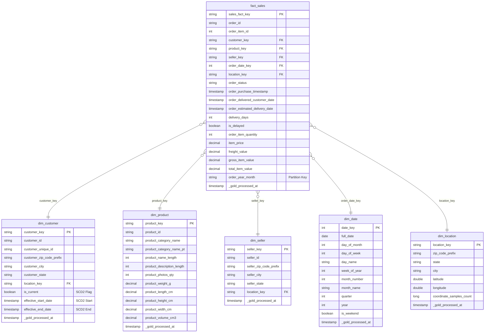

# AUREVIX — Star Schema Dimensional Model (Kimball Architecture)

## 1. Fact Table Grain
- **Table Name:** `fact_sales`
- **Fact Grain:** **Exactly ONE row per order-item line transaction (`order_id`, `order_item_id`)**.
- **Primary Key:** `sales_fact_key` (SHA-256 hash of `order_id || order_item_id`)
- **Row Count:** **112,650 rows** (0 grain violations, 0 variance against `silver_order_items`).

---

## 2. Entity-Relationship Diagram (Mermaid)

