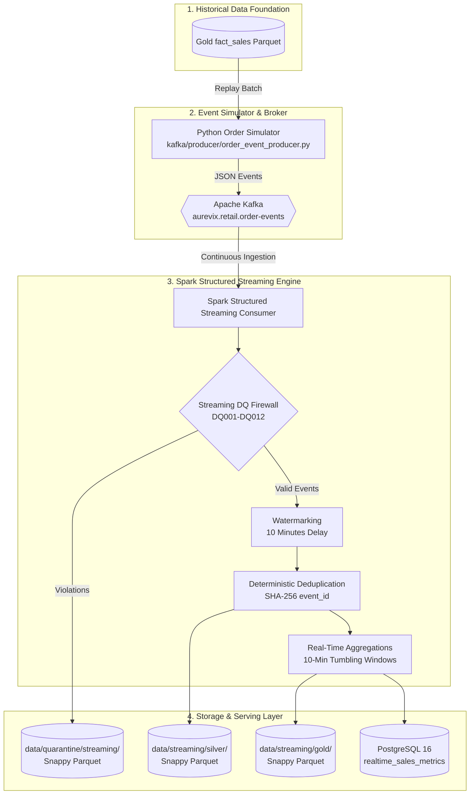

# AUREVIX — Real-Time Streaming Architecture

## 1. Technical Honesty & Simulation Model
The historical Olist dataset is static and does not originate from a live streaming message broker. To evaluate real-time retail streaming processing truthfully:

> **Architecture Principle:** Historical Olist records from Gold `fact_sales` are replayed through a controlled Python Event Simulator (`kafka/producer/order_event_producer.py`) as synthetic live retail JSON events into Apache Kafka, which are then processed continuously by Spark Structured Streaming.

---

## 2. Streaming Data Flow Architecture (Mermaid)

