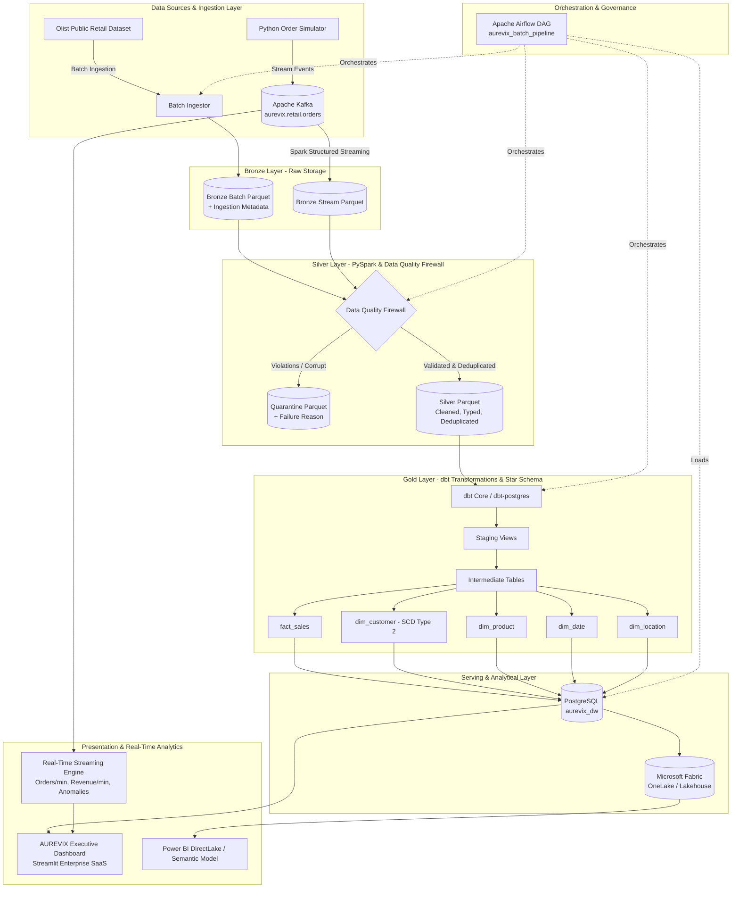
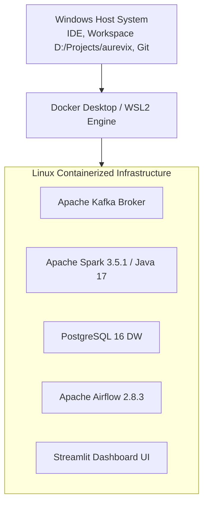

# AUREVIX - System Architecture

## 1. High-Level Architecture Overview

AUREVIX is an enterprise-grade hybrid Batch and Real-Time Streaming Data Engineering platform that ingests raw retail events, enforces a strict Data Quality Firewall, processes data across the Medallion layers (Bronze -> Silver -> Gold), models analytical dimensions and facts with dbt, orchestrates batch pipelines via Apache Airflow, computes real-time streaming metrics via Spark Structured Streaming, persists data in PostgreSQL and Microsoft Fabric, and visualizes KPIs through a high-performance Streamlit SaaS dashboard and Power BI.

---

## 2. Permanently Locked Technology Stack

| Layer | Locked Technology | Purpose |
| :--- | :--- | :--- |
| **Language** | Python (3.12.x locked) | Pipeline logic, simulator, and ingestion scripts |
| **Transformation Language** | SQL | Declarative dimensional modeling and testing |
| **Batch Engine** | Apache Spark / PySpark | Distributed ETL, schema enforcement, deduplication |
| **Streaming Broker** | Apache Kafka | Real-time event broker (`aurevix.retail.orders`) |
| **Streaming Processing** | Spark Structured Streaming | Event-time windowing, watermarks, micro-batching |
| **Orchestration** | Apache Airflow | Batch workflow orchestration, retries, and SLAs |
| **Transformation-as-Code** | dbt (dbt-postgres) | Staging, intermediate, and marts models & tests |
| **Analytical Warehouse** | PostgreSQL | Local relational serving warehouse (`aurevix_dw`) |
| **Storage / Format** | Apache Parquet | Snappy-compressed columnar format |
| **Cloud Analytics** | Microsoft Fabric | OneLake Lakehouse architecture |
| **Business Intelligence** | Power BI | Primary enterprise semantic modeling |
| **Operational UI** | Streamlit | 9-page real-time executive dashboard |
| **Containerization** | Docker + Docker Compose | Isolated, reproducible multi-service execution |
| **Testing** | pytest + dbt tests | Unit, integration, and data quality tests |
| **CI/CD** | GitHub Actions | Automated lint, test, and container build pipelines |
| **Documentation** | Markdown + Mermaid | Architecture diagrams and runbooks |

---

## 3. Host and Deployment Architecture

To ensure cross-platform reproducibility and isolate dependencies (such as Java 17 for Spark and Python 3.12 for Airflow), AUREVIX uses a containerized deployment architecture:

