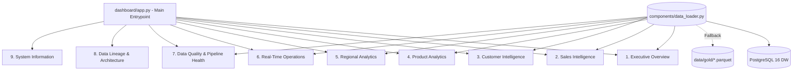

# AUREVIX — Dashboard Architecture (Streamlit Enterprise)

## 1. Information Architecture & Page Layout

## 2. Design System
- **Theme:** Enterprise Dark Mode (`#0b0f19` canvas, `#111827` cards, subtle glassmorphism borders).
- **Typography:** Inter for headings/metrics, JetBrains Mono for technical codes.
- **Latency & Caching:** `@st.cache_data(ttl=60)` with seamless PostgreSQL $
ightarrow$ Local Parquet fallback.
