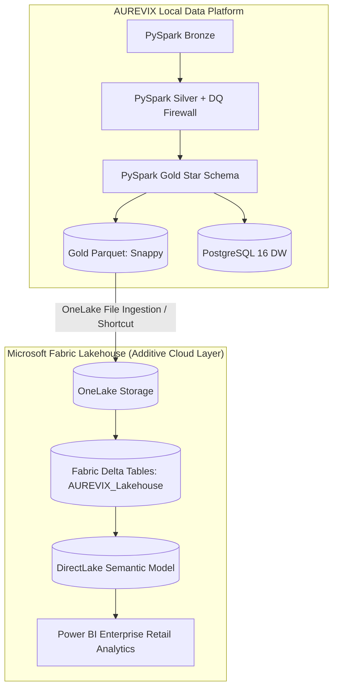

# AUREVIX — Microsoft Fabric Lakehouse & Cloud Deployment Specification

## 1. Overview & Cloud Architecture

## 2. Ingestion & Synchronization Strategy
- **Lakehouse Name:** `AUREVIX_Lakehouse`
- **Table Storage Format:** Delta Lake (Parquet with `_delta_log` transaction protocol).
- **Partitioning Strategy:** `fact_sales` partitioned by `order_purchase_year_month` for high-performance time-travel and partition pruning.
- **Access Strategy:** DirectLake mode in Power BI for zero-data-copy query performance against OneLake Delta parquet files.

## 3. Incremental Refresh & Watermarking
- **Initial Load:** Historical baseline load of all validated Gold Star Schema partitions (112,650 fact rows).
- **Incremental Cycle:** Driven by `_gold_processed_at` watermark timestamp and order year-month partition boundaries.
- **Idempotency:** Upsert/Merge operations match on composite primary key `sales_fact_key` (`(order_id, order_item_id)`) to guarantee zero duplicate fact rows.
