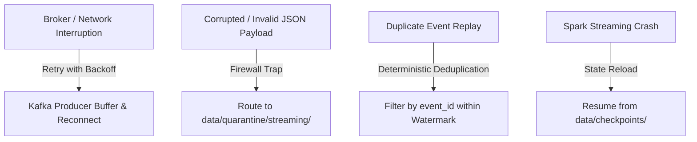

# AUREVIX — Streaming Failure Recovery Protocols

## 1. Scenarios and Recovery Strategies

```mermaid
flowchart TD
    E1[Broker / Network Interruption] -->|Retry with Backoff| R1[Kafka Producer Buffer & Reconnect]
    E2[Corrupted / Invalid JSON Payload] -->|Firewall Trap| R2[Route to data/quarantine/streaming/]
    E3[Duplicate Event Replay] -->|Deterministic Deduplication| R3[Filter by event_id within Watermark]
    E4[Spark Streaming Crash] -->|State Reload| R4[Resume from data/checkpoints/]
```
